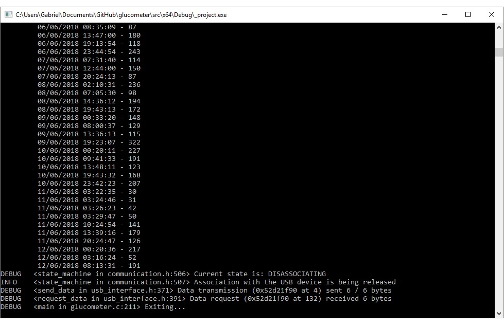

# glucometer

As a person with type 1 diabetes, I know how important it is to keep track of your blood glucose levels.
My particular device (an Accu-Check Active) has a USB port but no drivers and no software is provided to actually retrieve its internal data for further use.

Glucometer aims to provide just that: a free and open-source option for those who want to retrieve and analyze the data from blood glucose meters with USB connectivity. It's built according to the IEEE11073 standard for personal health devices.

# Current state

Currently glucometer is in its very early stages of development. It's being developed with portability in mind, but so far it's only been tested on Windows 10 x64.

If you compile and run the project you'll get a lot of debug messages printed to your console. If a blood glucose meter is connected to a USB port on your computer and **it's using WinUSB as a driver** (check out https://github.com/pbatard/libwdi/wiki/Zadig for more information on this step), glucometer will attempt to retrieve measurement data from the device and display it as shown below.

# TODO

- [x] Push initial commits to github
- [ ] Implement a simple GUI (with imgui)
- [ ] Implement user profiles, saving/loading data
- [ ] Implement graphing and report generation
- [ ] Start using CMake
- [ ] Work on portability

# Requirements

- libusb (+ glib)
- imgui
